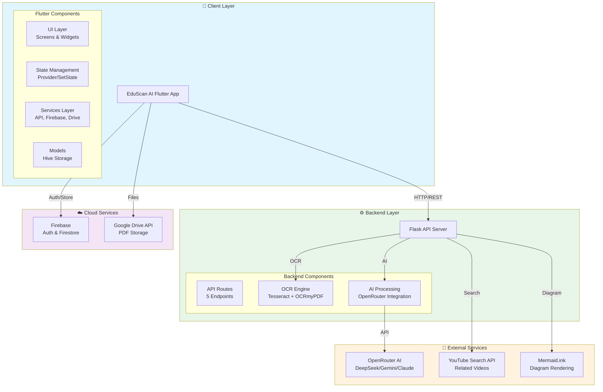
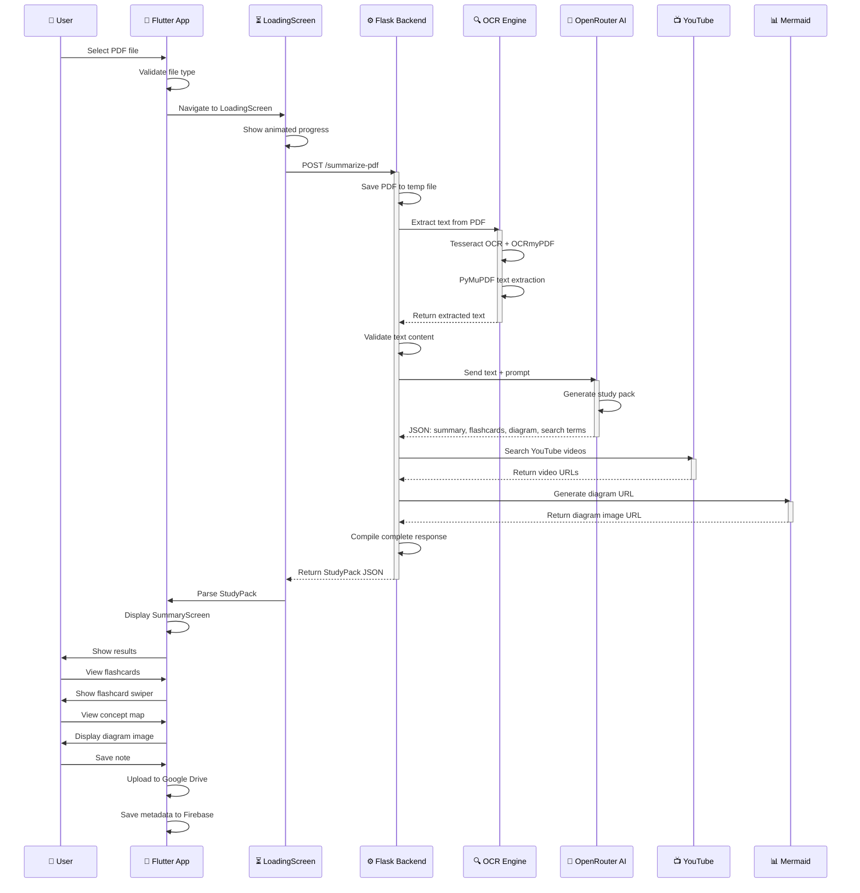
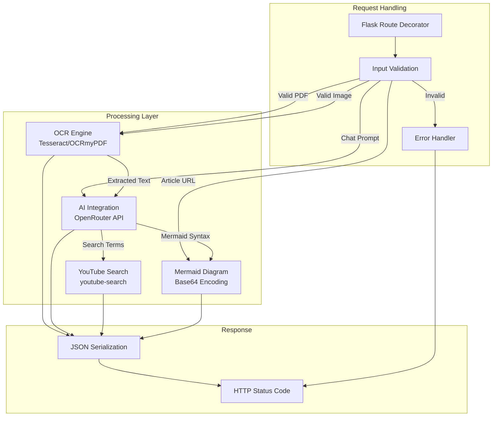
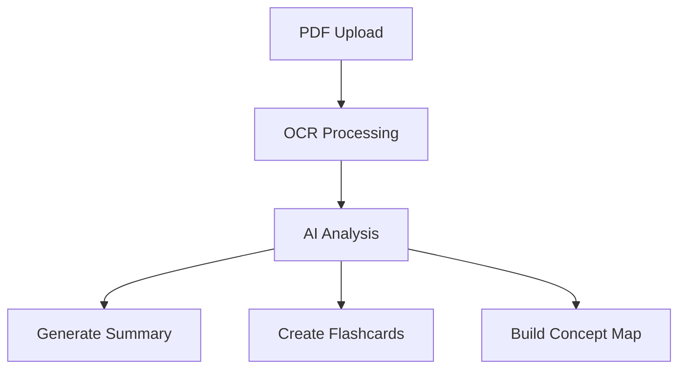

# EduScan AI - Architecture Documentation

This document provides a comprehensive overview of the EduScan AI system architecture, data flows, and technical implementation details.

---

## Table of Contents

1. [System Overview](#system-overview)
2. [Architecture Diagram](#architecture-diagram)
3. [Data Flow](#data-flow)
4. [Component Breakdown](#component-breakdown)
5. [API Endpoints](#api-endpoints)
6. [Database Schema](#database-schema)
7. [External Services](#external-services)
8. [Security Considerations](#security-considerations)

---

## System Overview

EduScan AI is a full-stack study assistant application consisting of:

- **Frontend**: Flutter mobile application (cross-platform: Android, iOS, Web, Desktop)
- **Backend**: Flask Python API server
- **AI Processing**: OpenRouter API integration
- **Storage**: Hybrid approach using Firebase (cloud) + Hive (local)

### Key Features

| Feature | Technology | Description |
|---------|-----------|-------------|
| **PDF OCR** | Tesseract + OCRmyPDF | Extract text from scanned PDFs |
| **AI Summary** | OpenRouter (DeepSeek) | Generate study summaries |
| **Concept Maps** | Mermaid.js | Visual diagram generation |
| **Flashcards** | Custom Flutter UI | Interactive study cards |
| **YouTube Integration** | YouTube Search API | Find related videos |
| **Cloud Sync** | Firebase + Google Drive | Cross-device synchronization |

---

## Architecture Diagram



---

## Data Flow

### PDF Upload & Processing Flow



---

## Component Breakdown

### Frontend (Flutter)

#### Project Structure

```
lib/
├── main.dart                 # App entry point, AuthGate
├── config/
│   └── app_config.dart       # Backend URL configuration
├── models/
│   ├── note_model.dart       # Note data structure
│   ├── study_pack.dart       # AI response structure
│   ├── class_model.dart      # Timetable class
│   ├── todo_model.dart       # Task items
│   └── journal_model.dart    # Journal entries
├── screens/
│   ├── login_screen.dart     # Authentication
│   ├── home_screen.dart      # Main dashboard
│   ├── add_notes/            # Note creation flow
│   ├── ai_summary/           # Results display
│   ├── timetable_screen.dart # Class schedule
│   ├── todo_list_screen.dart # Task management
│   ├── journal_screen.dart   # Personal journal
│   └── ...                   # Other screens
├── services/
│   ├── api_service.dart      # HTTP client
│   ├── firebase_service.dart # Firestore operations
│   ├── google_drive_service.dart # Drive integration
│   ├── notification_service.dart # Local notifications
│   └── lecture_notification_service.dart # Lecture monitoring
└── utils/
    └── constants.dart        # App constants & themes
```

#### Key Screens

| Screen | Purpose | Key Features |
|--------|---------|--------------|
| **LoginScreen** | User authentication | Google Sign-In, branding |
| **HomeScreen** | Main dashboard | Greeting, recent notes, live lecture |
| **AddNotesScreen** | PDF/image upload | Drag-drop UI, file validation |
| **LoadingScreen** | Processing state | Animated GIF, step-by-step progress |
| **SummaryScreen** | Display results | Summary, flashcards, videos, diagram |
| **FlashcardStoryScreen** | Study mode | Swipeable cards, animations |
| **ConceptDiagramScreen** | Visual learning | Zoomable Mermaid diagram |
| **MoreToolsScreen** | AI chat | Sakhi chatbot interface |
| **TimetableScreen** | Schedule | Weekly view, live lecture tracking |
| **DiscoverScreen** | Articles | RSS feed reader |

#### Services Layer

| Service | Responsibility | Key Methods |
|---------|---------------|-------------|
| **ApiService** | Backend HTTP communication | `uploadPDF()`, `uploadImages()` |
| **FirebaseService** | Firestore CRUD operations | `saveNoteMetadata()`, `getNotesStream()`, `deleteNote()` |
| **GoogleDriveService** | Drive file operations | `uploadFile()`, `downloadFile()`, `deleteFile()` |
| **NotificationService** | Local notifications | `scheduleReminder()`, `showLectureNotification()` |
| **LectureNotificationService** | Lecture monitoring | `monitorLectures()`, `isOngoing()` |

#### State Management

- **Approach**: Combination of Provider and StatefulWidget
- **Local Storage**: Hive for offline data (classes, todos, journal)
- **Cloud Sync**: Firebase Firestore for note metadata
- **File Storage**: Google Drive for PDFs

### Backend (Flask)

#### API Endpoints

| Endpoint | Method | Description | Request | Response |
|----------|--------|-------------|---------|----------|
| `/health` | GET | Health check | - | `{"status": "ok"}` |
| `/summarize-pdf` | POST | Process PDF | `multipart/form-data`: `pdf` file | StudyPack JSON |
| `/summarize-images` | POST | Process images | `multipart/form-data`: `files[]` array | StudyPack JSON |
| `/ask-sakhi` | POST | AI chat | JSON: `{"prompt": "..."}` | `{"response": "..."}` |
| `/fetch-article` | POST | Fetch article | JSON: `{"url": "..."}` | `{"content": "..."}` |

#### Backend Components



#### Python Dependencies

| Package | Version | Purpose |
|---------|---------|---------|
| Flask | 3.0.3 | Web framework |
| flask-cors | 4.0.1 | Cross-origin requests |
| ocrmypdf | 16.4.2 | PDF OCR processing |
| PyMuPDF | 1.24.9 | PDF text extraction |
| Pillow | 10.4.0 | Image processing |
| pytesseract | 0.3.13 | OCR engine |
| requests | 2.32.3 | HTTP client |
| beautifulsoup4 | 4.12.3 | HTML parsing |
| youtube-search | 2.1.2 | YouTube search |
| python-dotenv | 1.0.1 | Environment variables |
| gunicorn | 22.0.0 | Production WSGI server |

---

## API Endpoints

### 1. Health Check

**Endpoint:** `GET /health`

**Purpose:** Verify backend is running

**Response:**
```json
{
  "status": "ok"
}
```

**Status Codes:**
- `200 OK`: Backend is operational

---

### 2. Summarize PDF

**Endpoint:** `POST /summarize-pdf`

**Purpose:** Process a PDF file and generate study materials

**Request:**
- Content-Type: `multipart/form-data`
- Body: `pdf` (file field)

**Response:**
```json
{
  "summary": "A concise summary of the document...",
  "youtube_links": [
    "https://www.youtube.com/watch?v=abc123",
    "https://www.youtube.com/watch?v=def456"
  ],
  "concept_diagram_url": "https://mermaid.ink/img/base64...",
  "flashcards": [
    {
      "question": "What is X?",
      "answer": "X is Y..."
    }
  ]
}
```

**Error Responses:**
- `400 Bad Request`: No file uploaded or invalid file type
- `500 Internal Server Error`: OCR or processing failed

**Process Flow:**
1. Validate PDF file
2. Save to temporary file
3. Run OCR (Tesseract + OCRmyPDF)
4. Extract text with PyMuPDF
5. Send to OpenRouter AI
6. Parse AI response
7. Search YouTube for videos
8. Generate Mermaid diagram
9. Return complete study pack

---

### 3. Summarize Images

**Endpoint:** `POST /summarize-images`

**Purpose:** Process multiple images and generate study materials

**Request:**
- Content-Type: `multipart/form-data`
- Body: `files[]` (array of image files)

**Supported Formats:** PNG, JPG, JPEG, WEBP

**Response:** Same as `/summarize-pdf`

**Process Flow:**
1. Validate image files
2. Extract text from each image using Tesseract OCR
3. Combine all text
4. Send to OpenRouter AI
5. Generate study pack

---

### 4. Ask Sakhi

**Endpoint:** `POST /ask-sakhi`

**Purpose:** AI chat assistant for study questions

**Request:**
```json
{
  "prompt": "Explain quantum mechanics in simple terms"
}
```

**Response:**
```json
{
  "response": "Quantum mechanics is the branch of physics..."
}
```

**System Prompt:**
```
You are Sakhi, a friendly and helpful AI study assistant for students. 
Keep answers concise and easy to understand.
```

---

### 5. Fetch Article

**Endpoint:** `POST /fetch-article`

**Purpose:** Extract article content from a URL

**Request:**
```json
{
  "url": "https://example.com/article"
}
```

**Response:**
```json
{
  "content": "Full article text content..."
}
```

**Process:**
1. Fetch HTML from URL
2. Parse with BeautifulSoup
3. Remove scripts/styles
4. Extract paragraph text
5. Return cleaned content

---

## Database Schema

### Firebase Firestore

#### Collection: `notes`

```javascript
{
  "id": "string",                    // UUID
  "userId": "string",                // Firebase Auth UID
  "title": "string",                 // Note title
  "summary": "string",               // AI-generated summary
  "youtubeLinks": ["string"],        // Array of YouTube URLs
  "conceptDiagramUrl": "string",     // Mermaid diagram URL
  "flashcards": [{                   // Array of flashcard objects
    "question": "string",
    "answer": "string"
  }],
  "googleDriveFileId": "string",     // Google Drive file ID
  "createdAt": "timestamp",          // Creation timestamp
  "fileType": "string"               // "pdf" or "images"
}
```

### Local Storage (Hive)

#### Box: `classes`

```dart
class ClassModel {
  final String id;
  final String subjectName;
  final String dayOfWeek;      // "Monday", "Tuesday", etc.
  final String startTime;      // "09:00 AM"
  final String endTime;        // "10:30 AM"
  final String? location;
  final String? professor;
}
```

#### Box: `todos`

```dart
class TodoModel {
  final String id;
  final String title;
  final String? description;
  final bool isCompleted;
  final DateTime? dueDate;
  final DateTime createdAt;
}
```

#### Box: `journals`

```dart
class JournalModel {
  final String id;
  final String content;
  final DateTime date;
  final DateTime createdAt;
}
```

---

## External Services

### OpenRouter API

**Purpose:** AI model access for study material generation

**Configuration:**
- Base URL: `https://openrouter.ai/api/v1/chat/completions`
- Authentication: Bearer token (API key)
- Default Model: `deepseek/deepseek-r1-0528-qwen3-8b:free`

**Prompt Template:**
```
Based on the following educational notes, generate a comprehensive study pack.
Return only a valid JSON object.

Notes:
---
{extracted_text}
---

Use this shape:
{
  "summary": "A concise 200-300 word student-friendly summary.",
  "youtube_search_terms": ["term 1", "term 2", "term 3"],
  "concept_diagram": "graph TD; A[Start] --> B[Process];",
  "flashcards": [
    {"question": "Question", "answer": "Answer"}
  ]
}
```

**Error Handling:**
- `503`: AI service unavailable or rate limited
- `401`: Invalid API key
- `429`: Rate limit exceeded

### YouTube Search API

**Purpose:** Find educational videos related to study topics

**Implementation:** Python `youtube-search` library

**Process:**
1. Extract search terms from AI response
2. Search YouTube for each term
3. Return top result for each term
4. Limit to 3 videos maximum

**Response Format:**
```python
[
    "https://www.youtube.com/watch?v=video_id_1",
    "https://www.youtube.com/watch?v=video_id_2",
    "https://www.youtube.com/watch?v=video_id_3"
]
```

### Mermaid.ink

**Purpose:** Generate concept diagram images from Mermaid syntax

**Process:**
1. AI generates Mermaid diagram syntax
2. Base64 encode the syntax
3. Construct URL: `https://mermaid.ink/img/{base64}?bgColor=FFFFFF`
4. Flutter displays image from URL

**Example:**


### Firebase Services

**Authentication:**
- Provider: Google Sign-In
- SDK: `firebase_auth`

**Firestore:**
- Collections: `notes`
- Security Rules: User-based access control

**Storage:**
- Not directly used (Google Drive preferred for PDFs)

### Google Drive API

**Purpose:** Cloud storage for PDF files

**Scope:** `https://www.googleapis.com/auth/drive.file`

**Operations:**
- Upload PDF to "EduScanAI" folder
- Download PDF by file ID
- Delete file when note is deleted

---

## Security Considerations

### API Keys

**OpenRouter API Key:**
- Storage: Environment variable (`OPENROUTER_API_KEY`)
- Never commit to version control
- Rotate if exposed
- Use separate keys for dev/staging/production

**Firebase Configuration:**
- `google-services.json`: Ignored by `.gitignore`
- `GoogleService-Info.plist`: Ignored by `.gitignore`
- Use example files for documentation

**Google OAuth:**
- Client ID stored in Firebase project
- No secrets in client code

### Data Security

**PDF Storage:**
- Temporary files cleaned after processing
- Only metadata stored in Firestore
- PDFs stored in user's Google Drive

**Firestore Security Rules:**
```javascript
match /notes/{noteId} {
  allow read, write: if request.auth != null 
    && resource.data.userId == request.auth.uid;
}
```

**CORS:**
- Configured via `ALLOWED_ORIGINS` environment variable
- Default: `*` (allow all) for development
- Production: Specific domains only

### Input Validation

**File Upload:**
- Type validation (PDF, PNG, JPG, JPEG, WEBP)
- Size limits (25MB default)
- Filename sanitization

**API Requests:**
- Prompt length limits (8000 characters)
- URL validation for `/fetch-article`
- Content-Type validation

---

## Performance Considerations

### Optimization Strategies

| Area | Strategy | Implementation |
|------|----------|----------------|
| **PDF OCR** | Parallel processing | `use_threads=True` in OCRmyPDF |
| **AI Requests** | Timeout handling | 45-second timeout with retry |
| **Image Loading** | Caching | `cached_network_image` package |
| **Local Storage** | Efficient serialization | Hive with generated adapters |
| **Network Requests** | Compression | HTTP compression enabled |

### Scalability

**Backend:**
- Stateless design (no session storage)
- Horizontal scaling ready
- Gunicorn for production (worker processes)

**Database:**
- Firestore scales automatically
- Google Drive handles file storage scaling

---

## Development Workflow

### Local Development

1. Start backend: `python eduscan_backend/app.py`
2. Run Flutter: `flutter run --dart-define=EDUSCAN_BACKEND_URL=http://127.0.0.1:5000`
3. Test on device/emulator

### Testing

**Backend:**
```bash
cd eduscan_backend
python -m pytest
```

**Flutter:**
```bash
flutter test
dart analyze lib test
```

### Debugging

**Backend Logs:**
- Flask debug mode (development only)
- Gunicorn logs (production)
- Application logging via `app.logger`

**Flutter DevTools:**
- Network inspector for HTTP requests
- Performance profiling
- Memory usage monitoring

---

## Future Architecture Improvements

### Potential Enhancements

1. **Caching Layer**
   - Redis for AI response caching
   - CDN for diagram images

2. **Queue System**
   - Celery + Redis for async processing
   - Handle large PDFs without timeout

3. **Microservices**
   - Separate OCR service
   - AI service with load balancing

4. **WebSockets**
   - Real-time progress updates
   - Collaborative features

5. **Edge Computing**
   - Process small documents client-side
   - Reduce server load

---

## Resources

- [Flask Documentation](https://flask.palletsprojects.com/)
- [Flutter Documentation](https://flutter.dev/docs)
- [OpenRouter API Docs](https://openrouter.ai/docs)
- [Tesseract OCR](https://github.com/tesseract-ocr/tesseract)
- [OCRmyPDF Documentation](https://ocrmypdf.readthedocs.io/)

---

**Last Updated:** 2024

For questions about the architecture, please open an issue or refer to [SETUP.md](SETUP.md) for setup instructions.
