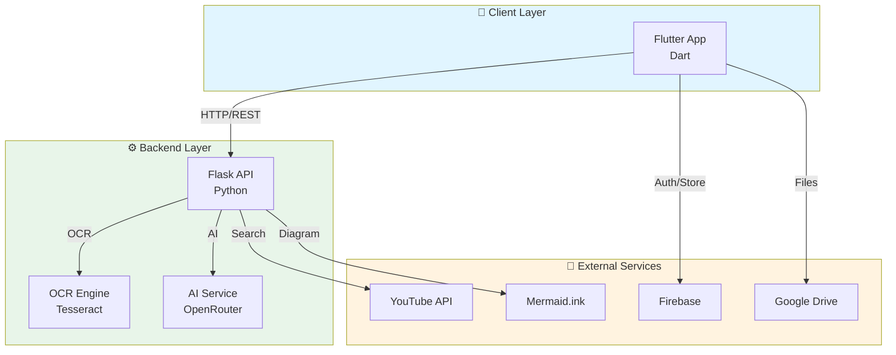

# EduScan AI

[](https://github.com/yashpatil2005/eduscan_ai/actions/workflows/ci.yml)
[](https://opensource.org/licenses/MIT)
[](https://flutter.dev)
[](https://python.org)

> **Transform PDFs into AI-powered study materials** 📚✨

EduScan AI is an open-source Flutter study assistant that converts PDFs and scanned notes into comprehensive study packs. Using OpenRouter AI, it generates summaries, concept maps, flashcards, and finds related YouTube videos to help students learn smarter, not harder.


---

## ✨ Features

| Feature | Description | Technology |
|---------|-------------|------------|
| 📄 **PDF Processing** | Upload PDFs and extract text using OCR | Tesseract + OCRmyPDF |
| 🤖 **AI Summarization** | Generate concise study summaries | OpenRouter AI (DeepSeek) |
| 🗺️ **Concept Maps** | Visual diagrams to understand relationships | Mermaid.js |
| 🃏 **Flashcards** | Interactive study cards for memorization | Flutter Swiper |
| 📺 **YouTube Integration** | Find relevant educational videos | YouTube Search API |
| 💬 **Sakhi AI Chat** | Ask questions and get instant help | OpenRouter AI |
| 📅 **Smart Timetable** | Track classes with live lecture notifications | Local notifications |
| ✅ **Todo Lists** | Manage study tasks and deadlines | Hive Local Storage |
| 📝 **Study Journal** | Personal study notes and reflections | Hive Local Storage |
| ☁️ **Cloud Sync** | Backup notes to Firebase & Google Drive | Firebase + Drive API |

---

## 📸 Screenshots

<table>
  <tr>
    <td></td>
    <td></td>
    <td></td>
    <td></td>
  </tr>
  <tr>
    <td align="center"><b>Login</b></td>
    <td align="center"><b>Dashboard</b></td>
    <td align="center"><b>Upload</b></td>
    <td align="center"><b>Summary</b></td>
  </tr>
</table>

*Screenshots coming soon. Feel free to contribute!*

---

## 🏗️ Architecture

EduScan AI follows a client-server architecture with AI-powered backend processing:



**Tech Stack:**
- **Frontend:** Flutter 3.8+ with Dart
- **Backend:** Flask with Python 3.10+
- **AI:** OpenRouter API (DeepSeek, Gemini, Claude)
- **OCR:** Tesseract + OCRmyPDF + PyMuPDF
- **Storage:** Firebase (Firestore) + Google Drive + Hive (local)
- **Notifications:** flutter_local_notifications

For detailed architecture documentation, see [ARCHITECTURE.md](ARCHITECTURE.md).

---

## 🚀 Quick Start

Get EduScan AI running locally in 5 minutes:

### Prerequisites

- [Flutter SDK](https://flutter.dev/docs/get-started/install) 3.8+
- [Python](https://www.python.org/downloads/) 3.10+
- [Tesseract OCR](https://github.com/tesseract-ocr/tesseract) (for PDF processing)
- [OpenRouter API Key](https://openrouter.ai/keys) (free)

### 1. Clone Repository

```bash
git clone https://github.com/yashpatil2005/eduscan_ai.git
cd eduscan_ai
```

### 2. Backend Setup

```bash
cd eduscan_backend

# Create virtual environment
python -m venv .venv

# Activate (Windows)
.venv\Scripts\activate
# Activate (macOS/Linux)
source .venv/bin/activate

# Install dependencies
pip install -r requirements.txt

# Configure environment
copy .env.example .env  # Windows
cp .env.example .env    # macOS/Linux

# Edit .env and add your OpenRouter API key
# OPENROUTER_API_KEY=sk-or-v1-your-key-here

# Start backend
python app.py
```

Backend runs at `http://127.0.0.1:5000`

### 3. Flutter Setup

```bash
# In new terminal, from project root
flutter pub get

# Run with local backend
flutter run --dart-define=EDUSCAN_BACKEND_URL=http://127.0.0.1:5000
```

### 4. Test It

1. Sign in with Google (or skip if Firebase not configured)
2. Tap "Add Notes"
3. Upload a PDF
4. Watch the AI generate your study pack!

**That's it!** 🎉 For detailed setup, see [SETUP.md](SETUP.md).

---

## 📚 Documentation

| Document | Description |
|----------|-------------|
| **[SETUP.md](SETUP.md)** | Complete step-by-step setup guide with OpenRouter configuration |
| **[ARCHITECTURE.md](ARCHITECTURE.md)** | System architecture, API documentation, and data flow diagrams |
| **[DEPLOYMENT.md](DEPLOYMENT.md)** | Deploy backend to Render for production |
| **[CONTRIBUTING.md](CONTRIBUTING.md)** | How to contribute to the project |
| **[SECURITY.md](SECURITY.md)** | Security policies and vulnerability reporting |
| **[CODE_OF_CONDUCT.md](CODE_OF_CONDUCT.md)** | Community guidelines |

---

## 🛠️ Tech Stack

### Frontend
- **Flutter** 3.8+ - Cross-platform UI framework
- **Dart** 3.0+ - Programming language
- **Firebase** - Authentication, Firestore, Storage
- **Hive** - Local database for offline support
- **HTTP** - Backend communication

### Backend
- **Flask** 3.0+ - Python web framework
- **Gunicorn** - Production WSGI server
- **OCRmyPDF** - PDF OCR processing
- **Tesseract** - OCR engine
- **PyMuPDF** - PDF text extraction
- **OpenRouter** - AI model access

### AI Models

EduScan AI works with multiple AI models through OpenRouter:

| Model | Cost | Best For |
|-------|------|----------|
| **DeepSeek R1** | FREE 🎉 | Development & Testing |
| Gemini Flash 1.5 | Free tier | Production speed |
| Llama 3.1 | Free tier | Balanced performance |
| Claude 3 Haiku | Paid | Premium quality |

**Default:** DeepSeek R1 (free and works great!)

---

## 🎯 Key Features Explained

### AI Study Pack Generation

Upload any PDF or image of notes and get:

1. **📄 Smart Summary** - AI-generated concise summary (200-300 words)
2. **🗺️ Concept Map** - Visual diagram showing relationships between concepts
3. **🃏 Flashcards** - Interactive study cards with questions and answers
4. **📺 YouTube Videos** - AI finds relevant educational videos on the topic

### Sakhi AI Assistant

Chat with Sakhi, your AI study companion:
- Ask questions about any topic
- Get explanations in simple terms
- Summarize articles from URLs
- Study tips and guidance

### Smart Organization

- **Timetable** - Weekly class schedule with live lecture notifications
- **Todo Lists** - Task management with deadline reminders
- **Journal** - Personal study log and reflections
- **All Notes** - Browse and search saved study packs

---

## 🧪 Testing

### Backend Tests

```bash
cd eduscan_backend
python -m pytest
```

### Flutter Tests

```bash
# Run all tests
flutter test

# Analyze code
dart analyze lib test

# Check for issues
flutter doctor
```

### Manual Testing

1. Test PDF upload with various file sizes
2. Verify OCR works on scanned documents
3. Check AI responses quality
4. Test offline functionality
5. Verify notifications work

---

## 🚀 Deployment

### Deploy Backend to Render (Free)

1. Fork this repository
2. Create [Render](https://render.com) account
3. Create new Web Service from GitHub
4. Configure:
   - **Build:** `pip install -r requirements.txt`
   - **Start:** `gunicorn app:app`
   - **Root Directory:** `eduscan_backend`
5. Add environment variable: `OPENROUTER_API_KEY`
6. Deploy!

Your backend will be live at `https://your-service.onrender.com`

For detailed instructions, see [DEPLOYMENT.md](DEPLOYMENT.md).

---

## 🤝 Contributing

We welcome contributions! Here's how to get started:

1. **Fork** the repository
2. **Create** a feature branch: `git checkout -b feature/amazing-feature`
3. **Commit** your changes: `git commit -m 'Add amazing feature'`
4. **Push** to the branch: `git push origin feature/amazing-feature`
5. **Open** a Pull Request

See [CONTRIBUTING.md](CONTRIBUTING.md) for detailed guidelines.

### Development Setup

```bash
# Backend development
cd eduscan_backend
python app.py  # Flask dev server with hot reload

# Flutter development
flutter run --hot  # Hot reload enabled
```

---

## 📄 License

This project is licensed under the MIT License - see the [LICENSE](LICENSE) file for details.

```
MIT License

Copyright (c) 2024 SyntaxSpace

Permission is hereby granted, free of charge, to any person obtaining a copy
of this software and associated documentation files...
```

---

## 🙏 Acknowledgments

- **OpenRouter** - For providing access to powerful AI models
- **Flutter Team** - For the amazing cross-platform framework
- **Tesseract OCR** - For making text extraction possible
- **Mermaid.js** - For beautiful diagram generation
- **Contributors** - Thank you for making this project better!

---

## 📞 Support

### Getting Help

- 📖 **Documentation**: Check [SETUP.md](SETUP.md) and [ARCHITECTURE.md](ARCHITECTURE.md)
- 🐛 **Bug Reports**: [Open an issue](https://github.com/yashpatil2005/eduscan_ai/issues)
- 💡 **Feature Requests**: [Discussions](https://github.com/yashpatil2005/eduscan_ai/discussions)
- 🔒 **Security**: See [SECURITY.md](SECURITY.md)

### Contact

- **Email**: akshrlab@gmail.com
- **Project**: [github.com/yashpatil2005/eduscan_ai](https://github.com/yashpatil2005/eduscan_ai)

---

## 🗺️ Roadmap

### Current Features ✅
- PDF OCR and AI summarization
- Concept maps and flashcards
- YouTube video recommendations
- Sakhi AI chat assistant
- Timetable with notifications
- Todo lists and journal
- Google Drive integration

### Coming Soon 🚧
- [ ] Web app support
- [ ] Collaborative study groups
- [ ] Anki export for flashcards
- [ ] Dark mode
- [ ] Multi-language support
- [ ] Offline AI processing
- [ ] Web scraping for research papers

### Future Ideas 💡
- [ ] Chrome extension for web articles
- [ ] Integration with learning management systems
- [ ] Spaced repetition algorithm
- [ ] Voice notes transcription
- [ ] AI-powered quiz generation

---

## ⭐ Star History

[](https://star-history.com/#yashpatil2005/eduscan_ai&Date)

**If you find this project helpful, please give it a star!** ⭐

---

## 💪 Built By

**SyntaxSpace** - Making learning easier with AI

Made with ❤️ using Flutter and Python

---

<p align="center">
  <a href="https://github.com/yashpatil2005/eduscan_ai/stargazers">
    
  </a>
  <a href="https://github.com/yashpatil2005/eduscan_ai/network/members">
    
  </a>
</p>

<p align="center">
  <b>Happy Studying! 📚✨</b>
</p>
